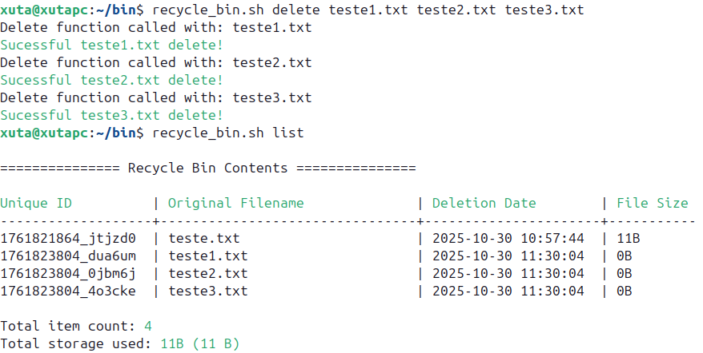
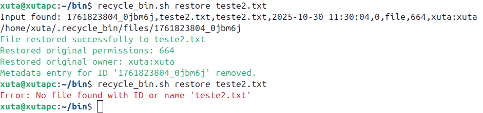

# Linux Recycle Bin System

## Authors
* Rodrigo Simões - 125514
* Simão Pinto - 126099

## Description
This project is a Recycle Bin simulator for Linux-based systems, implemented entirely in **Shell Script (Bash)**. Developed as part of the **"Sistemas Operativos"** university course. This system maintains detailed metadata to ensure accurate and complete restoration of files and directories.

## Installation
No complex installation is required, as the system is a *standalone* Bash script.

1.  **Create the file:** Save the main code (including the `delete_file`, `restore_file`, etc. functions) into a file named `recycle_bin.sh`.
2.  **Grant execute permission:**
    ```bash
    chmod +x recycle_bin.sh
    ```
3.  **Initialization:** The script automatically initializes the directory structure (`$HOME/.recycle_bin`) upon the first execution of any command.

## Usage
All commands are executed through the main script file.

Action | Syntax

* **Delete** | `$0 delete <file(s)>` 
* **List** | `$0 list [--detailed]` 
* **Restore** | `$0 restore <ID | Name>` 
* **Search** | `$0 search <pattern>` 
* **Statistics**| `$0 statistics | $0 stats` 
* **Empty All** | `$0 empty` 
* **Delete Item** | `$0 empty <ID>` 
* **Force Empty** | `$0 empty --force`
* **Preview** | `$0 preview <ID>`
* **Quota** | `$0 quota` 
* **Help** | `$0 <help | --help | -h>` 

## Features
### Core Functionality
- **Delete (`delete`):** Moves files and directories to quarantine.
- **List (`list (--detailed)`)**: Displays all items in the recycle bin, with optional detailed view.
- **Restore (`restore`):** Restores files to the original path, recovering permissions and owner (subject to execution permissions).
- **Conflict Resolution:** During restoration, detects name conflicts and allows overwriting or renaming.
- **Search (`search`):** Allows searching for items by ID, name, or original path.
- **Storage Limits:** Checks file size and available space before deletion/moving.
- **Log Management:** Logs all deletion and emptying operations.

### Advanced Features
- **Statistics (`statistics/stats`):** Displays detailed metrics:
    - Total item count.
    - Total space used and quota percentage (`MAX_SIZE_MB=1024`).
    - Breakdown by type (files vs. directories).
    - Age analysis (oldest and newest item).
- **Permanent Delete (`empty`):**
    - Selective deletion by ID (`$0 empty <ID>`).
    - Total emptying (`$0 empty`).
    - Supports the `--force` flag for complete emptying without confirmation.
- **Preview (`preview`):** 
    - Shows the first 10 lines of a specific item without restoring or deleting it.
- **Quota Management (`quota`):** 
    - Displays current usage against the defined quota (default: `MAX_SIZE_MB=1024`).

## Configuration
The main configurations are defined in the header of the script.

Variable | Default Value | Description

* `RECYCLE_BIN_DIR` | `$HOME/.recycle_bin` | Directory where the recycle bin is created.

* `MAX_SIZE_MB` | `1024` | Maximum size limit (in MB) a single file/directory can have to be moved to the recycle bin.

* `RETENTION_DAYS` | `30` | Days of file retention before automatic cleanup.

## Examples
- **Delete Files:**

- **List Items:**

- **Detailed Item List:**

- **Restore File:**

- **Search Items:**

- **View Statistics:**


## Known Issues
None at the moment.

## References
- Bash Shell Programming Documentation (Gnu/Linux)
- **AI Assistance:** Architectural design review and debugging assistance provided by **Gemini** (a LLM by Google).
- ShellCheck - <https://www.shellcheck.net/>.
- `stat`, `grep`, `sed`, `awk`, `bc` utility documentation.
